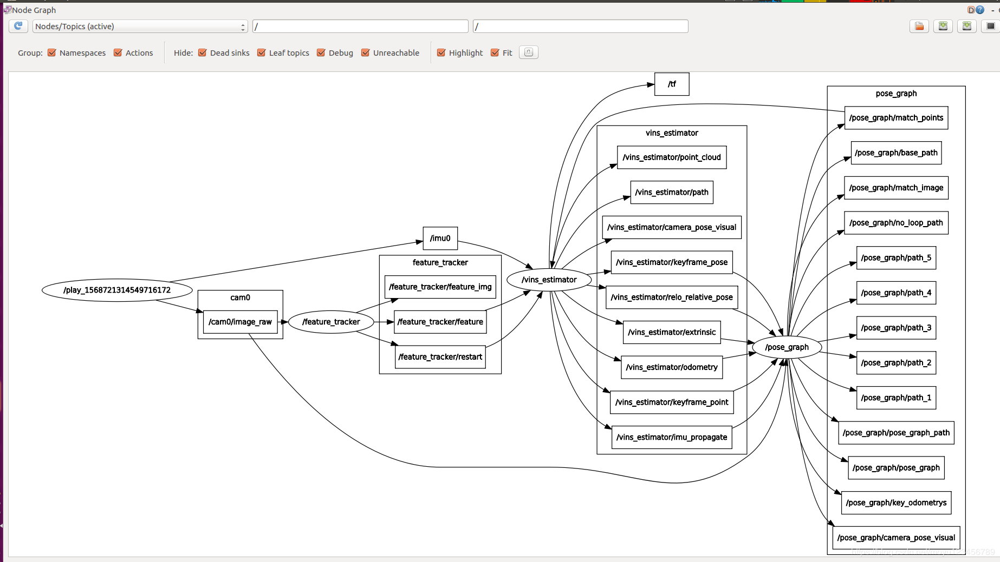

三个结点：



| Node | feature_tracker  | vins_estimator | pose_graph
|--|:--|:--|:--|
| 功能 | 从相片提取特征点，发布 | 订阅imu, feature, restart消息 | 
|  | feature, restart | | keyframe_pose, |

### vins_estimator
含有三个回调函数
- imu_callback
  - 将imu_msg存入imu_buf
  - con.notify_one()唤醒process()线程
  - 调用predict()对imu当前的状态进行propogate
- feature_callback
  - feature_msg存入feature_buf
  - con.notify_one()唤醒process()线程
- restart_callback
  - 清除缓存，重置参数

process() 函数很重要
- 调用getMeasurements()函数，尝试获得能够匹配的一个img和若干imu数据
- 使用前一个img和当前img之间的imu数据进行积分
  - p1直接扔掉,p2的imu不做积分，插值得到i3.5
  - p3的imu用 i3.5，i5, i6, i6.5积分，得到 p2-p3之间的预积分项。
```c
//     ( i1    i2     i3     i4  )(  i5     i6    i7 )  i8     imu数据
// p1                   p2                     p3              征点数据
```


### pose_graph

```c
pose_graph_node.main()
{
PoseGraph posegraph;

// 加载vocabulary文件，用于回环检测
PoseGraph::loadVocabulary(vocabulary_file);

// 加载旧的位姿图
PoseGraph::loadPoseGraph();
	PoseGraph::loadKeyFrame(keyframe, false);
		// 检测回环，计算相对位姿，发送给estimator
		detectLoop(cur_kf, cur_kf->index);
		cur_kf->findConnection(old_kf)

		// 将BRIEF加入db，db中没有旧位姿图的算子？
		addKeyFrameIntoVoc(cur_kf);
			db.add(keyframe->brief_descriptors);

		keyframelist.push_back(cur_kf);

}
```

